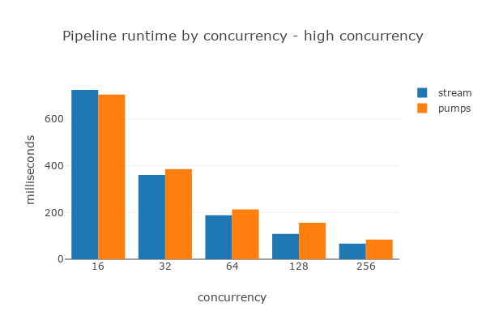

# Async Pipeline Pattern - Eager to work

## What We Found About Streams
In the [last](https://github.com/alexpusch/rust-magic-patterns/blob/master/rust-stream-visualized/Readme.md) post, we did a thorough investigation of the running characteristics of Rust's [futures::Stream](https://docs.rs/futures/latest/futures/stream/trait.Stream.html). We discovered some pretty surprising results. Where we expected highly concurrent execution, we found some friction points.

We visualized stream execution as an animation.

This stream:
```rust
async fn async_work(i32) -> i32 {...}

#[tokio::main]
async fn main() {
    let stream = stream::iter(0..10)
        .map(async_work)
        .buffered(3)
        .map(async_work)
        .buffered(3); 

    while let Some(next) = stream.next().await {
        println!("finished working on: {}", next);
    }
}
```
Executes as follows:

<p align="center">
    
</p>

Examine this animation with confusion for a few seconds. Notable issues:
- Futures from the first `map` seem to "hang" while futures in the second `map` execute and vice versa.
- Despite being interested in 3 concurrently running futures, when a future completes, the stream does not pull a new unit of work immediately.
- Despite being interested in 3 concurrently running futures, the first `map` must wait for the second `map` to complete before pulling a new unit of work.

Now, look at this alternative async pipeline approach:
<p align="center">
    
</p>

Examine this animation with some more confusion, and behold - all issues are gone! In this post, I'll describe an alternative approach for async pipelining.

## Why is futures::Stream Suboptimal?
To really understand the reasons for this friction, you should dive into [futures::stream code](https://github.com/rust-lang/futures-rs/blob/master/futures-util/src/stream/stream/buffered.rs#L70). I'll try to argue that Rust's futures lazy nature has something to do with it.

Rust futures are *lazy* in nature. A future is only executed when awaited or polled. As a consequence, `future::Stream` has a similar lazy nature - work is *pulled* when some component is ready to receive it. This lazy nature makes stream implementation a bit awkward. Each stream component either polls its input or performs its work, not both. While a `buffered` stream operation awaits its internal pending futures list, it does not poll upstream, which in turn remains idle.

I have no intent of disrespecting `futures` or `Stream`, the crate and API are awesome async Rust fundamentals. I will present an alternative that might suite certain use cases.

## Async Pipeline Pattern 
The use case we're interested in is a series of async operations on some stream or collection of data.
As an example, let's imagine an image processing app:

The app receives a list of image URLs and:
- Sends an HTTP request to download the image.
- Processes the image asynchronously.
- Saves results in Object storage, AWS S3 for example.

Of course, this example can be implemented by a simple `for` loop with some async calls in it. Don't get me wrong - this is a perfectly valid implementation, and you probably should start with that.

```rust
// sometimes perfectly valid 
for url in urls {
  let image = download_image(url).await;
  let processed_image = process_image(image).await;
  save_to_s3(processed_image).await;
}
```

In some more complex, real-world use cases, you'll need to face some constraints and requirements:

- **Concurrency** - We have multiple cores to utilize and plenty of bandwidth to exploit. Running on each URL one by one will leave us with a lot of unused resources and a slow execution time.
- **Rate Limiting** - The other side of the concurrency coin. If we try to process all of our URLs at once, we'll hit our resource ceiling immediately. We'll max out our CPU cores, eat up all the memory, and hit the bandwidth cap. In our example, we are downloading images from a remote service. If we don't control our request rate, we might cause trouble for it as well.
In fact, we can say that each pipeline step has its own concurrency control parameter. For example, maybe our image processing is computationally demanding, and we're interested in increasing the number of CPU cores working on it, while writing to S3 is very fast and can be allocated less CPU time.
- **Backpressure** - Sometimes a pipeline step takes longer than usual. While this happens, we want the upstream steps to keep producing results. On the other hand, we should control the size of this buffering. In our example, images are large, and we don't want to accumulate too many of them in memory.

To meet these constraints optimally, we will regard each of the steps as an independent "task", each doing its part as fast as it can, forwarding the results to the next "task". A "pipeline", if you will.

## Tasks and Channels

The approach I'll describe in this post utilizes [spawned tasks](https://docs.rs/tokio/latest/tokio/task/fn.spawn.html) and [channels](https://docs.rs/tokio/latest/tokio/sync/mpsc/fn.channel.html). `Tasks` are eager; the future they receive runs immediately without being coupled to other futures or tasks. This "independence" of each pipeline step will allow us to control concurrency in a more liberated manner.

Let's begin with spawning a task that downloads images and forwards the result to an output channel:
```rust
let (url_sender, mut url_receiver) = mpsc::channel(64);
let (image_sender, mut image_receiver) = mpsc::channel(64);

tokio::spawn(async move {
    while let Some(url) = url_receiver.recv().await {
      let image = download_image(url).await;
      image_sender.send(image).await.unwrap(); // TODO: handle errors!
    }
});

for url in urls {
  url_sender.send(url).await.unwrap();
}

while let Some(image) = image_receiver.recv().await {
  println!("got image");
}
```
Note how our spawned task downloads images as fast as they arrive, even if for some godforsaken reason `println!()` becomes slow.

## Connecting Pipes into a Pipeline
After we've seen a single pipeline task, let's pipe together several of them.

```rust
let (url_sender, mut url_receiver) = mpsc::channel(64);
let (image_sender, mut image_receiver) = mpsc::channel(64);
let (processed_sender, mut processed_receiver) = mpsc::channel(64);
let (output_sender, mut output_receiver) = mpsc::channel(64);

tokio::spawn(async move {
    while let Some(url) = url_receiver.recv().await {
        let image = download_image(url).await;
        image_sender.send(image).await.unwrap(); // TODO: handle errors!
    }
});

tokio::spawn(async move {
    while let Some(image) = image_receiver.recv().await {
        let processed_image = process_image(image).await;
        processed_sender.send(processed_image).await.unwrap(); // TODO: handle errors!
    }
});

tokio::spawn(async move {
    while let Some(image) = processed_receiver.recv().await {
        let image_url = image.url.clone();
        save_image(image).await;
        output_sender.send(image_url).await.unwrap(); // TODO: handle errors!
    }
});

for url in urls {
    url_sender.send(url).await.unwrap();
}

while let Some(url) = output_receiver.recv().await {
    println!("done with {url}");
}
```

# Adding Concurrency

Nice, we have 3 tasks doing their processing eagerly. Downloading, processing, and saving are all performed concurrently relative to each other, but what about downloading multiple images at once? The current code is still serial within the tasks.
To fix this, let's introduce `FuturesUnordered` for some concurrency.

```rust
tokio::spawn(async move {
    let mut futures = FuturesUnordered::new();

    loop {
        tokio::select! {
            // receive new url to download
            Some(url) = url_receiver.recv() => {
                futures.push(download_image(url));
            },
            // get the result of a completed download
            Some(image) = futures.next() => {
                image_sender.send(image).await.unwrap(); // TODO - handle errors!
            },
            // we run out of urls to receive or futures to await. The job is done
            else => break
        }
    }
});
```

Limiting concurrency is easy as well. I'll leave it as an exercise to the reader. (Answer in the [example code](./src/main.rs))

# Backpressure
The suspicious reader should think at this point - won't our memory usage get out of hand? If some task runs as fast as it can, but its follower is particularly slow, we'll keep accumulating more and more results. Well, suspicious reader, please note that I used a [bounded channel](https://docs.rs/tokio/latest/tokio/sync/mpsc/fn.channel.html) in the example. The amount of results we can accumulate is bounded and controlled for each task independently. When the output channel is full, the *pushing* of the results hangs, stopping the computation.

In fact, this usage of bounded channels gives us an elegant backpressure solution.

Backpressure allows the pipeline to handle occasional slowness, accumulating a limited amount of results in memory, avoiding idling.

Here's a visualization of the benefit of backpressure. In this animation, the second stage of the pipeline is slower than the first one. Without backpressure, once the first stage reaches its maximum of 3 concurrent futures, it would become idle and wait for the next step to finish its work. In this example, we configure backpressure to allow 3 additional items to be processed while the second stage is doing its work. Notice how this change reduces idle times and makes the pipeline complete its processing faster.

<p align="center">
    
</p>

# Error Handling
We have a working async pipeline, but like an innocent junior, we ignored error handling. Let's fix that.
There are two main scenarios we need to handle: 
- The output channel has closed.
- One of our tasks has panicked.

## Output Channel Closing
In our async pipeline, each task forwards its result by an outbound `Sender`. If the `Receiver` of this sender drops, `sender.send()` will return an error. If no one listens to our results, there's no point in generating them, right? Let's add handling for this case:

```rust
tokio::spawn(async move {
    while let Some(url) = url_receiver.recv().await {
        let image = download_image(url).await;
        if let Err(err) = image_sender.send(image).await {
            break;
        }
    }
});
```

If the output channel is no longer active, we break the receiving loop and let the task close.

## Tasks Panic
This scenario is a bit more complex. By default, on single-threaded programs, when the main thread panics, the process unwinds the stack, prints out the error, and exits. Since the code in our pipeline is in a tokio task, the panic will terminate the task, but our main thread will keep running. What is the desired outcome of a pipeline task panic? Should we terminate the process? Should we recreate the pipeline? In any case, Rust will require us to handle this case and leave us the freedom to program the handling ourselves.

To handle a panicked task, we need to be notified that the task terminates. For this, we'll use `spawn` return value - the `JoinHandle`.

```rust
let h1 = tokio::spawn(async move {
    // ...
});

let h2 = tokio::spawn(async move {
    // ...
});

let h3 = tokio::spawn(async move {
    // ...
});

// first consume the pipeline output
while let Some(url) = output_receiver.recv().await {
    println!("done with {url}");
}

// are we here due to success or failure?
match tokio::try_join!([h1, h2, h3]) {
    Ok(_) => report_success(),
    Err(err) => handle_error(err) // panic if you will
}
```

After fully consuming our pipeline output channel, we need to figure out whether the pipeline has terminated successfully or due to one of the steps panicking.

Note that we did not talk about application-level errors. Each task can forward a `Result<_, Error>` which can be handled in the various pipeline stages or in the output consumption as usual.

## Termination
Our pipeline is constructed from a bunch of tasks. How should we go about terminating these tasks when we finish processing? This is another elegant feature of this task-channel chain we created. Our pipeline receives its input by a `Receiver`. When the corresponding `Sender` is dropped, and the receiver has been fully consumed, the `while` loop will naturally exit, dropping the next task's input `Sender`. This will create a cascade of closing tasks. The first task will consume its input and exit, then the second task will do the same, and so forth. Pretty elegant if you ask me.

# Packing Concept into a Crate
The async pipeline pattern is awesome but pretty verbose. You have to create the input and output channels and spawn tasks for each component of the pipeline. I've created the [Pumps](https://github.com/alexpusch/pumps_rs) crate to wrap this concept into a user-friendly API. Pumps is pretty much a builder for the async pipeline pattern. Each method creates a task and an output channel which is forwarded to the input channel of the following method.

This is how our example looks with Pumps:

```rust
let (mut output_receiver, join_handle) = pumps::Pipeline::from_iter(urls)
    .map(download_image, Concurrency::concurrent_unordered(4))
    .backpressure(64)
    .map(process_image, Concurrency::concurrent_unordered(8))
    .map(save_to_s3, Concurrency::serial())
    .build();

while let Some(url) = output_receiver.recv().await {
    println!("done with {url}");
}
```

# Benchmarks
I described an alternative method for async pipelining, but how does it compare to `Stream` in practice?

To benchmark the performance of the libraries, I'll define a similar pipeline using both `futures::Stream` and `Pumps`. The example pipeline is composed of three tasks, each running an async function with a runtime of 5-10ms with a uniform distribution. The random runtime is used to simulate real-life fluctuations in task runtimes. The task runtime is randomly chosen at the start of the benchmark and is passed to each library test. The measured runtime is the processing time of 1000 elements that were given to the pipeline as input.

We are comparing this:
```rust
let mut stream = input
    .map(/* task 1 */)
    .buffer_unordered(concurrency)
    .map(/* task 2 */)
    .buffer_unordered(concurrency)
    .map(/* task 3 */)
    .buffer_unordered(concurrency);
```

vs:

```rust
let (mut receiver, handler) = pumps::Pipeline::from_iter(input)
    .map(/* task 1 */, Concurrency::concurrent_unordered(concurrency))
    .map(/* task 2 */, Concurrency::concurrent_unordered(concurrency))
    .map(/* task 3 */, Concurrency::concurrent_unordered(concurrency))
    .build();
```

Let's check the effect of the concurrency number of each task on the pipeline runtime:

<p align="center">
    
</p>

Interesting! We can see that in low concurrency numbers, the difference is very significant. However, we do see some diminishing returns.

Let's check out higher concurrency numbers:

<p align="center">
    
</p>

In higher concurrency, the advantages of Pumps disappear. In fact, the overhead of tasks and channels makes it the slower option.

## Effect of Backpressure
As mentioned before, backpressure can increase pipeline efficiency by allowing tasks to continue working while some downstream task slows down. To demonstrate this effect, let's benchmark a three-step pipeline deliberately slowing down the tasks for some executions. This time the task runtime is chosen from the 5-10ms range, but in 20% of the executions, the runtime is 20ms.

<p align="center">
    
</p>

In the results, we see a nice performance gain for low concurrency numbers. The benefit of backpressure really depends on the runtime distribution of your async tasks, with the best results arising for the "usually fast, sometimes slow" scenario.

# Conclusion
I've set out with this investigation to solve issues I had with `Stream` and found out about the async pipeline pattern. This pattern offers some elegant solutions for concurrent execution utilizing basic Rust and Tokio concurrency primitives. This approach is, ahem, borrowed from the multithreading world where instead of Tokio tasks we just spawn plain old threads, but I find it to work in the async world as well.

The benchmarks show nice gains for low concurrency use cases, but the task and channel overhead starts to build up and reduces the gain on high concurrency numbers. As always, you should pick the solution according to your use case.
