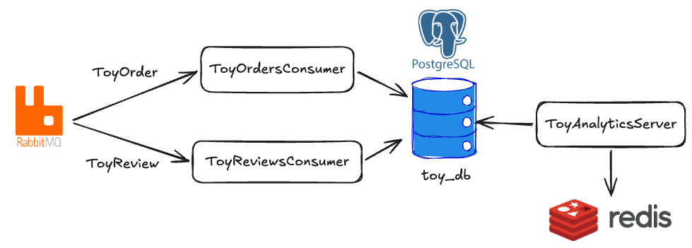

# Delightful integration tests in Rust

When I first learned about testing in Rust I was surprised by the lack of what I consider a basic feature: test setup and teardown. Many other popular testing frameworks have it: [jest](https://jestjs.io/docs/setup-teardown), [pytest fixtures](https://docs.pytest.org/en/stable/reference/fixtures.html), and so on.

Global setup and teardown are especially useful in integration tests. In integration tests, as well as in similar component tests or end-to-end tests, the code runs against a complete or partial set of the application infrastructure. In this important class of tests we don't mock out database access or skip message brokers. Setup and teardown are good candidates for provisioning that infrastructure so we can reuse it across multiple tests.

But alas, Rust does not provide built-in setup and teardown, and what's more, by default all tests run concurrently on different threads, so creating and reusing global state is a bit clunky. Seems that writing integration tests in Rust is a miserable experience. Or is it?  

> [!NOTE]
> Some crates provide similar capabilities. For example [test-context](https://crates.io/crates/test-context)
> and [rstest](https://docs.rs/rstest/latest/rstest/).

Despite my initial skepticism I now think that integration tests in Rust are actually a delight. The delightful Rust concept i'm refering to is RAII, and the crate I now reach for is [testcontainers-rs](https://github.com/testcontainers/testcontainers-rs). The core idea is simple: make Docker container creation easy and ergonomic, and clean containers up automatically. This idea, leveraging RAII for automatic cleanup, removes the need for global setup and teardown and paves a direct path to completely isolated tests that can comfortably run in parallel.

## Resource Acquisition Is Infrastructure 

Rust heavily uses the [RAII](https://doc.rust-lang.org/rust-by-example/scope/raii.html) (Resource Acquisition Is Initialization) pattern. RAII's main goal is to automatically clean up memory and resources, removing the need for manual management in many common use cases.

This useful pattern can be exploited a bit, and extended to automatically manage out-of-process resources. In our use case we wish to make a Docker container a resource and use Rust's ownership rules and `Drop` trait to clean it up automatically.

To demonstrate RAII relevance, in this first example we'll use the [bollard](https://docs.rs/bollard/latest/bollard/) crate to start a RabbitMQ Docker container. We'll create a `RabbitMqContainer` struct that manages the running container for our test:

```rust
struct RabbitMqContainer {
    docker: Docker,
    container_id: String,
}

impl RabbitMqContainer {
    async fn start() -> anyhow::Result<Self> {
        let docker = Docker::connect_with_local_defaults()?;

        let container = docker
            .create_container(
                Option::<CreateContainerOptions>::None,
                ContainerCreateBody {
                    image: Some("rabbitmq:3.8.22-management".to_string()),
                    exposed_ports: Some(
                        HashMap::from([("5672/tcp".to_string(), HashMap::new())]),
                    ),
                    ..Default::default()
                },
            )
            .await?;

        docker
            .start_container(&container.id, Some(StartContainerOptions::default()))
            .await?;

        Ok(Self {
            docker,
            container_id: container.id,
        })
    }
}
```

### Using Drop to cleanup running containers
Our next step is to implement `Drop` to stop and remove the container automatically:

```rust
impl Drop for RabbitMqContainer {
    fn drop(&mut self) {
        let docker = self.docker.clone();
        let container_id = self.container_id.clone();

        async_drop(async move {
            docker
                .remove_container(
                    &container_id,
                    Some(RemoveContainerOptions {
                        force: true,
                        ..Default::default()
                    }),
                )
                .await
                .expect("Failed to remove container");
        });
    }
}
```

### The async drop caveat
As you can see in the example, stopping a container is an async operation, but [async drop](https://doc.rust-lang.org/std/future/trait.AsyncDrop.html) is a nightly-only, [WIP](https://github.com/rust-lang/rust/issues/126482), feature. At first glance this puts a stick in the spokes of our plan, but we can hack our way out of this. Let's borrow [this](https://github.com/testcontainers/testcontainers-rs/blob/main/testcontainers/src/core/async_drop.rs) helper from `testcontainers-rs`. The hack runs the cleanup in a different thread and blocks `drop` until the cleanup is done. Not ideal, but good enough for tests.

We can now write a test that utilizes `RabbitMqContainer`

```rust
#[tokio::test]
async fn test_with_rabbitmq() -> anyhow::Result<()> {
    let _rabbitmq = RabbitMqContainer::start().await?;

    // run your tests over the resources defined in RabbitMqContainer
    let rabbitmq_channel = get_rabbitmq_channel("amqp://localhost:5672").await?;
    //...
    
    // No need to cleanup manually. Sweet!

    Ok(())
}
```

### Drop caveat
Relying on `Drop` to clean up resources is pretty sweet, but we need to keep in mind that in some cases `drop` is not called. A relevant example is forceful program termination using SIGINT (`ctrl+c`), SIGTERM, SIGKILL, or OOM. Some of these can be caught and handled, some less so. `testcontainers-rs` [Watchdog](https://github.com/testcontainers/testcontainers-rs/blob/main/testcontainers/src/watchdog.rs) can mitigate some of these issue

# `testcontainers-rs`
Now that we're familiar with the usefulness of RAII in tests, let's look at a crate that elevates the previous example and offers a utility I really enjoy: [testcontainers-rs](https://docs.rs/crate/testcontainers/latest).

## Toy example
Examples in posts such as this tend to be simplistic. I've tried to create something a bit more realistic than a tiny toy example. So I give you the "Toy analytics" app. This app includes two RabbitMQ message consumers, `ToyOrder` and `ToyReview`, and an HTTP server that provides analytical endpoints backed by a Postgres database and a Redis caching layer. You can find the full source code [here](./src/main.rs).

<p align="center"></p>

As you can see, even this small app requires several infrastructure servers to be created and managed. 

## Setting up the tests

First order of business is to start a RabbitMQ node. To achieve this we will create a `RabbitMqImage` struct that implements the [Image](https://docs.rs/testcontainers/latest/testcontainers/core/trait.Image.html) trait. The `Image` trait allows us to define container properties, such as tag, cmd, mounts and more.

```rust
pub struct RabbitMqImage;

impl Image for RabbitMqImage {
    fn name(&self) -> &str {
        "rabbitmq"
    }

    fn tag(&self) -> &str {
        "3.8.22-management"
    }
}
```

We can now implement a `TestEnv` struct. `TestEnv` will hold and manage all infrastructure needed for our tests. Just rabbitMq for now.

```rust
pub struct TestEnv {
    _rabbitmq_container: ContainerAsync<RabbitMqImage>,
    // channel to our newly created RabbitmqNode. Will be useful in following tests
    pub rabbitmq_channel: Channel,
}

impl TestEnv {
    pub async fn start() -> anyhow::Result<Self> {
        let rabbitmq_container = RabbitMqImage.start().await?;
        let amqp_port = rabbitmq_container.get_host_port_ipv4(5672).await?;
        let amqp_url = format!("amqp://127.0.0.1:{}", amqp_port);

        let rabbitmq_channel = get_rabbitmq_channel(&amqp_url).await?;

        Ok(Self {
            _rabbitmq_container: rabbitmq_container,
            rabbitmq_channel,
        })
    }
}
```

With `TestEnv` we can now start to write our first integration test. The test will send several `ToyOrdered` messages and verify that the `top_toys` endpoint returns the expected result.

```rust
#[tokio::test]
async fn toy_order_received_top_toys_returns_top_results() -> anyhow::Result<()> {
    let env = TestEnv::start().await?;

    for event in [
        ToyOrdered::new(TEST_TIME, GI_JOE_ID, CUSTOMER1_ID),
        ToyOrdered::new(TEST_TIME + Duration::minutes(5), GI_JOE_ID, CUSTOMER2_ID),
        ToyOrdered::new(TEST_TIME + Duration::minutes(10), GI_JOE_ID, CUSTOMER3_ID),
        ToyOrdered::new(TEST_TIME + Duration::minutes(15), BARBIE_ID, CUSTOMER1_ID),
        ToyOrdered::new(TEST_TIME + Duration::minutes(20), BARBIE_ID, CUSTOMER2_ID),
    ] {
        publish_toy_ordered(&env.rabbitmq_channel, &event).await?;
    }

    // coming up
}
```

## Wait for containers startup

We didn't assert anything yet, but we're already running into an error:
```
Toy orders consumer error: IO error: Connection reset by peer (os error 104)

Caused by:
    Connection reset by peer (os error 104)
```

The reason for this error is two-fold:
1. We've published a message to RabbitMQ before the node had a chance to fully initialize.
2. I lied to you, there's an additional method we should implement on `Image`: `fn ready_conditions(&self) -> Vec<WaitFor>;`. This is a key feature for making the process delightful. Each piece of infrastructure has an initialization process that we must wait for. `ready_conditions` gives us a nice API to define it. We'll wait for a string to appear in RabbitMQ's stdout that indicates startup has completed.

```rust
impl Image for RabbitMqImage {
    // ...

    fn ready_conditions(&self) -> Vec<WaitFor> {
        vec![WaitFor::message_on_stdout("Server startup complete")]
    }
}
```

## Out-of-the-box images

Before we move on to writing the rest of the test, let's introduce the [testcontainers-modules](https://crates.io/crates/testcontainers-modules) crate. This crate has lots of popular image definitions. In fact we did not have to implement `RabbitMqImage` ourselves; we could have just used the [RabbitMQ module](https://docs.rs/testcontainers-modules/latest/testcontainers_modules/rabbitmq/struct.RabbitMq.html). Similarly, images for [Postgres](https://docs.rs/testcontainers-modules/latest/testcontainers_modules/postgres/struct.Postgres.html) and [Redis](https://docs.rs/testcontainers-modules/latest/testcontainers_modules/redis/struct.Redis.html) are available.

Let's update our `TestEnv` to include Postgres and Redis instances. In addition we'll start our [App](./src/app.rs) to spin up all consumers and API endpoints. This would make `TestEnv` a complete, and isolated execution of our program.
```rust
pub struct TestEnv {
    _rabbitmq_container: ContainerAsync<RabbitMqImage>,
    _pg_container: ContainerAsync<postgres::Postgres>,
    _redis_container: ContainerAsync<Redis>,
    pub rabbitmq_channel: Channel,
    pub postgres_pool: PgPool,
    pub redis_conn: MultiplexedConnection,
    pub api_address: SocketAddr,
}

impl TestEnv {
    pub async fn start() -> anyhow::Result<Self> {
        let (
            (_rabbitmq_container, rabbitmq_url),
            (_pg_container, postgres_url),
            (_redis_container, redis_url),
        ) = tokio::try_join!(start_rabbitmq(), start_postgres(), start_redis())?;

        let app = App::new(AppConfig {
            postgres_url: postgres_url.clone(),
            rabbitmq_url: rabbitmq_url.clone(),
            redis_url: redis_url.clone(),
            api_port: 0,
        })
        .await?;

        let api_address = app.api_server.local_address()?;

        tokio::spawn(async move {
            if let Err(error) = app.run().await {
                eprintln!("Error running app: {:?}", error);
            }
        });

        let rabbitmq_channel = get_rabbitmq_channel(&rabbitmq_url).await?;
        let postgres_pool = get_pg_pool(&postgres_url).await?;
        let redis_conn = get_redis_conn(&redis_url).await?;

        Ok(Self {
            _rabbitmq_container,
            _pg_container,
            _redis_container,
            rabbitmq_channel,
            postgres_pool,
            redis_conn,
            api_address,
        })
    }
}

```

## Full test
Finally, we can create a test that:
1. starts RabbitMQ, Postgres, and Redis
2. starts all our app consumers and API servers
3. publishes `ToyOrdered` messages to our app
4. calls our analytics API endpoints and asserts the response
5. cleans up everything automatically

All this in a rather ergonomic package:

```rust
#[tokio::test]
async fn toy_order_received_top_toys_returns_top_results() -> anyhow::Result<()> {
    let env = TestEnv::start().await?;

    for event in [
        ToyOrdered::new(TEST_TIME, GI_JOE_ID, CUSTOMER1_ID),
        ToyOrdered::new(TEST_TIME + Duration::minutes(5), GI_JOE_ID, CUSTOMER2_ID),
        ToyOrdered::new(TEST_TIME + Duration::minutes(10), GI_JOE_ID, CUSTOMER3_ID),
        ToyOrdered::new(TEST_TIME + Duration::minutes(15), BARBIE_ID, CUSTOMER1_ID),
        ToyOrdered::new(TEST_TIME + Duration::minutes(20), BARBIE_ID, CUSTOMER2_ID),
    ] {
        publish_toy_ordered(&env.rabbitmq_channel, &event).await?;
    }

    /// Since we're using an async message queue, we cannot assume that the data is immediately available after publishing an event.
    /// This function utilize the worst solution for this issue - just wait a few seconds. For simplicity, we'll stick with this.
    wait_for_consistency().await;

    let top_response = request_top_toys(
        env.api_address,
        TEST_TIME + Duration::minutes(3),
        TEST_TIME + Duration::minutes(17),
    )
    .await?;

    assert_eq!(
        top_response,
        TopToysResponse {
            toys: vec![
                TopToyResponse {
                    toy_id: GI_JOE_ID,
                    orders: 2,
                },
                TopToyResponse {
                    toy_id: BARBIE_ID,
                    orders: 1,
                },
            ],
        }
    );

    Ok(())
}
```

### Eventual Consistency Caveat

Sharp-eyed readers might have noticed the sneaky `wait_for_consistency().await` call. This function sweeps an important caveat of full integration tests under the carpet. We publish messages into our system, but we have no natural, external way to verify that all messages have been processed. Without waiting for a consistent state, our tests might assert too early and fail, or worse, occasionally pass. This is the dreaded flaky integration test problem.

For the sake of simplicity in this post, I've settled on the worst possible solution: a static one-second sleep. This is a mediocre approach because it relies on an arbitrary amount of waiting time. If the duration is too long, we'll add unnecessary seconds to our test runtime; if it's too short, our tests will become flaky.

## Key benefits
Now that our app infrastructure is created and controlled from code, we get some useful capabilities.

### Natural isolation leads to simple concurrency
With each test getting its own test environment, including its own message broker, database, and database schema, we achieve complete isolation between tests. It becomes impossible for one test to pollute another test's database tables or for messages from one test to reach another.

This emerging isolation allows us to run as many concurrent tests as we would like.

### Fine-grained infrastructure control from code
Testing a Redis outage? Just:
```rust
env.stop_redis().await?
```

Testing for a database performance issue? One possible extension is:
```rust
env.start_postgres_with_cpu_limit(...)
```

### No external tools needed
A popular alternative approach for setting up infrastructure is to define a docker-compose.yaml, and use an external script or harness to `docker compose up`. This can work well, but requires your team to introduce an alternative test running command. Using test-containers allows us to retain the good, old, `cargo test`.

## Simplicity and isolation vs speed
We've talked about the benefits of the proposed strategy, but this post would be incomplete without mentioning the main drawback: speed. Having each test start up a complete environment does carry a time penalty. Each test needs to wait for containers to start, wait for them to become ready, run full database migrations, and so on.

You can offset some of that penalty by running tests concurrently, but only up to a point: the machine running the tests has limited resources.

This is a tradeoff each project must evaluate: stronger isolation in exchange for a potential time penalty.
Furthermore, while this post is about integration or end-to-end tests, these kinds of tests are only one part of a healthy test suite alongside unit tests, which are not bound by infrastructure startup costs.

## Final thoughts
RAII is at the core of Rust's memory management strategy. I've demonstrated its usefulness for resource cleanup in the context of integration tests, but of course this is a general-purpose technique. For example, `tempfile` [uses RAII to clean up generated files at runtime](https://github.com/Stebalien/tempfile/blob/master/src/dir/mod.rs#L498) is a great demonstration of this technique.

In the context of testing, I keep coming back to this idea and to testcontainers-rs. In the “real infrastructure” vs “mocks” debate, I tend to lean toward the real-infrastructure side of the spectrum. Having an easy way to spin up dependencies makes the whole experience much more ergonomic.
