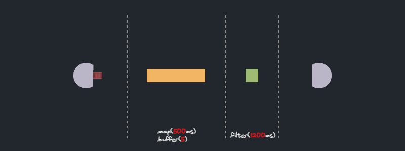
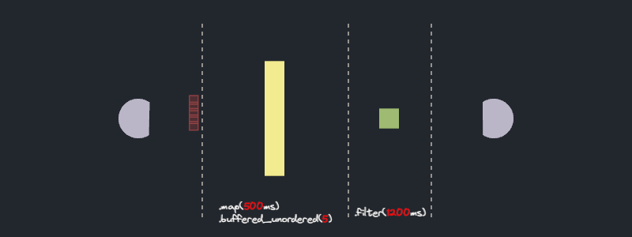

# Rust Stream API visualized and exposed

<details>
  <summary>Additional languages</summary>
  <ul>
    <li>
      <a href='https://github.com/yushengguo557/rust-magic-patterns/blob/translation-zh-cn/rust-stream-visualized/Readme_ZH_CN.md'>Simplified Chinese</a> - <a href="https://github.com/yushengguo557">@yushengguo557</a>
    </li>
  </ul>
</details>


Managing concurrency in real-world applications can be quite tricky. Developers must grapple with concurrency control, back pressure, error handling, and more. Thankfully, Rust provides us with the async/await mechanism, and on top of that, the [Stream API](https://docs.rs/futures/latest/futures/stream/index.html). 
The Stream methods allow us to elegantly define a pipeline of asynchronous operations with a nifty abstraction addressing common use cases.

Unfortunately, elegance sometimes masks complexity. Can you look at a streaming pipeline and understand how many operations would run in parallel? What about the order? I found it trickier than it seems, so naturally, as a complete overkill, I wrote a Bevy visualization to investigate it. This investigation brought light to some truly unexpected results - so unexpected, that in some cases, you might want to reconsider using this API.

## Overview of Stream API
Let's start with a brief overview of the Stream API. The following code defines an async pipeline that iterates over integers from 0 to 10 and executes the `async_work` method with a concurrency limit of 3. The result is then filtered using the `async_predicate` method. This is awesome! With just a few lines of code, we've created a non-trivial async control flow. 

```rust
async fn async_work(i32) -> i32 {...}
async fn async_predicate(i32) -> Option<i32> {...}

async fn buffered_filter_example() {
    let stream = stream::iter(0..10)
        .map(async_work) // async_work returns a future. The output of this stage is a stream of futures
        .buffered(3) // polls stream of futures and runs at most 3 concurrently
        .filter_map(async_predicate); // filters out the results of the previous stage using async_predicate function

    pin!(stream);

    while let Some(next) = stream.next().await {
        println!("finished working on: {}", next);
    }
}
```

Amm, we can already see some complex elements. For instance, why did I use `filter_map` instead of `filter`? What's this pesky `pin!(stream)` doing? I won't digress into these questions. Instead, here are some informative links:
- [Put a Pin on That](https://ohadravid.github.io/posts/2023-07-put-a-pin-on-that/)
- [How will futures::StreamExt::filter work with async closures?](https://www.reddit.com/r/rust/comments/r47iqi/how_will_futuresstreamextfilter_work_with_async/)

The goal of this investigation is to get a better understanding of the execution order, concurrency, and back pressure characteristics of such pipelines. For example, in the code above, the map method executes 3 `async_work` concurrently, but what if `async_predicate` is a long operation? will it continue to concurrently run more `async_work`? Supposedly after it completes 3 invocations, it should be able to run more while `async_predicate` runs in the background right? If so, will it take an unbounded amount of memory? 
What about `filter_map`? it does not have a clear concurrency parameter. Does it runs the provided method serially? or with unlimited concurrency? 

The documentation leaves some of these questions unclear. We need to see it with our own eyes.

## Experiment tool - visualizing Rust streams

I used [Bevy](https://bevyengine.org/) to visualize the flow of data in a streaming pipeline. The idea involves defining a streaming pipeline with methods that report their progress via a channel. I used Bevy's `EventWriter` to forward this information to a Bevy rendering system.

Here's how it looks:

<p align="center">
    
</p>

In the visualization, we see a representation of each streaming item navigating through different stages of the pipeline. Units of work start from the *source* and move to the `map(..).buffered(..)` stage. To simulate real world async work I used a small loop of `sleep()` calls. This represents real world scenarios where async methods have multiple `await` calls and allows us to visualize the future run progress. 

```rust
for i in 0..5 {
    tokio::time::sleep(duration / 5).await;
    tx.send(/* update bevy rendering system */).unwrap();
}
```

We visualize future progress via a tiny progress bar on each item. After an item completes the `buffered` stage, it proceeds to the *sink* and finishes its journey. 

It is important to note that the visualization is sourced from actual running Rust code. This isn't a simulation; it is a real-time visualization of the Rust Stream pipeline.

You can find the source code [here](https://github.com/alexpusch/rust-stream-vis).
## Experiment 1: [buffered](https://docs.rs/futures/latest/futures/stream/trait.StreamExt.html#method.buffered)

```rust
stream::iter(0..10)
    .map(async_work)
    .buffered(5);
```
> buffer up to at most n futures and then return the outputs in the same order as the underlying stream. No more than n futures will be buffered at any point in time

### Experiment questions
- Will the `buffered` method fetch a new unit of work from the source stream as soon as any unit of work completes, or only when the earliest unit of work completes and sent as output to the next stage?

<p align="center">
    
</p>

All right! look at it purr! As expected, each item goes through `async_work`. The `.buffered(5)` step runs at most 5 futures concurrently, retaining completed features until their predecessors completes as well. 

### Experiment result
The `buffered` method **does not** acquire a new unit of work once an arbitrary item completes. Instead, it only does so once the earliest item is completed and advances to the next stage. This makes sense. A different behavior would require the `buffered` method to store the results of an unbounded number of futures, which could lead to excessive memory usage. 

I wonder if there's a case to be made for a `buffered_with_back_pressure(n: usize, b: usize)` method that will allow some items to be taken from the source stream, up to `b` times.


## Experiment 2: [buffer_unordered](https://docs.rs/futures/latest/futures/stream/trait.StreamExt.html#method.buffer_unordered)

```rust
stream::iter(0..10)
    .map(async_work)
    .buffer_unordered(5);
```
> buffer up to n futures and then return the outputs in the order in which they complete. No more than n futures will be buffered at any point in time, and less than n may also be buffered

### Experiment questions
- Will the `buffer_unordered` method take a new unit of work from the source stream as soon as any unit of work completes, or only when the earliest unit of work is completed and sent to the next stage?

<p align="center">
    
</p>

Unlike `buffered`, `buffer_unordered` does not retain completed futures and immediately makes them available to the next stage upon completion.

### Experiment result
The `buffer_unordered` method **does** fetch a new unit of work as soon as any unit of work completes. Contrary to `buffered`, the unordered version does not need to retain completed future results to maintain output order. This allows it to process the stream with higher throughput.

## Experiment 3: [filter_map](https://docs.rs/futures/latest/futures/stream/trait.StreamExt.html#method.filter_map)

```rust
stream::iter(0..10)
    .filter_map(async_predicate);
```
> Filters the values produced by this stream while simultaneously mapping them to a different type according to the provided asynchronous closure. As values of this stream are made available, the provided function will be run on them.

### Experiment questions
- Does the `filter` method executes features in parallel or in series? 

<p align="center">
    
</p>

### Experiment result
No surprises here. The `filter` operator processes each future in series.

If we want to accomplish async filtering with concurrency we can use a blend of `map`, `buffered`, and `filter_map(future::ready)`. The `map().buffered()` duo would calculate the predicate concurrently while `filter_map` remove failed items from the stream

```rust
stream::iter(0..10)
    .map(async_predicate)
    .buffered(5)
    .filter_map(future::ready); // the ready function will return the predicate result wrapped in a ready future 
```

## Experiment 4: buffered + filter_map
```rust
stream::iter(0..10)
    .map(async_work)
    .buffered(3)
    .filter_map(async_predicate);
```

### Experiment question
- How will a long-running `filter_map` step affect the concurrency of the `buffered` step?

<p align="center">
    
</p>

Ok, this is unexpected! The stream does not function as I initially thought. While `async_predicate` is being executed, no `async_work` future is progressing. Even further, no new future starts to run until the first batch of five is complete. What's going on?

Let's see what happens when we replace `buffered` with `buffer_unordered`.

<p align="center">
    
</p>

The situation is pretty much identical. Again, the `async_work` futures are suspended until `async_predicate` is completed.

Could it be something to do with `filter_map`? Let's attempt to stick two `buffered` steps sequentially:

<p align="center">
    
</p>

Nope, the behavior remains the same.

### What's going on?
Turns out I'm not the first that encounters this difficulty. This is the same issue [Barbara battled with](https://rust-lang.github.io/wg-async/vision/submitted_stories/status_quo/barbara_battles_buffered_streams.html).

To truly grasp what's happening, we need a solid understanding of Futures, async executors, and the stream API. Resources such as [The async book](https://rust-lang.github.io/async-book) and perhaps fasterthanlime's [Understanding Rust futures by going way too deep](https://fasterthanli.me/articles/understanding-rust-futures-by-going-way-too-deep) can serve as good starting points.

I'll attempt to give you some intuition.

The first clue comes from the question - when does Rust run two futures concurrently? There's the [join!](https://docs.rs/futures/latest/futures/macro.join.html) and [select!](https://docs.rs/futures/latest/futures/macro.select.html) macros, and the ability to [spawn](https://docs.rs/tokio/latest/tokio/task/fn.spawn.html) new async tasks. However, the Stream API neither `join` nor `select` over futures created by different pipeline steps, nor does it `spawn` new tasks each time it executes a future.

### A Deeper Dive
Let's take a closer look at our example and try to analyze the control flow.

```rust
let stream = stream::iter(0..10)
    .map(async_work)
    .buffered(5) 
    .filter_map(async_predicate);

pin!(stream);

while let Some(next) = stream.next().await {
    println!("finished working on: {}", next);
}
```

First we create the stream instance. Futures in Rust aren't executed until they are `await`ed. Therefore, the first line of the example has no standalone effect. 
Lets look at the type definition of the `stream` variable: 
```rust
FilterMap<
  Buffered<Map<Iter<Range<i32>>, fn async_work(i32) -> impl Future<Output = i32>>>,
  impl Future<Output = Option<i32>>,
  fn async_predicate(i32) -> impl Future<Output = Option<i32>
>
```
After the initial shock we find five nested structs `Range` within `Iter` within `Map` within `Buffered` within `Filter`. 
These types of structs are referred to as "adapters". Each adapter holds state and data and implements some trait, in our case, `Stream`. They wrap their own logic around this trait.

For example, the `Buffered` [adapter](https://github.com/rust-lang/futures-rs/blob/master/futures-util/src/stream/stream/buffered.rs) owns a source `stream` and a `in_progress_queue: FuturesOrdered` to manage the buffering.

Elegantly skip over `pin!`.

So, what happens on the first `stream.next().await` command? The `Next` future [calls](https://github.com/rust-lang/futures-rs/blob/master/futures-util/src/stream/stream/next.rs#L32)`stream.poll_next_unpin(cx)`, where `stream` is an instance of `FilterMap`.

In turn, the `FilterMap::poll_next` implementation [polls](https://github.com/rust-lang/futures-rs/blob/master/futures-util/src/stream/stream/filter_map.rs#L79) its inner stream - the `Buffered` stream - and executes `async_predicate` on the result.
The `Buffered::poll_next` method [polls](https://github.com/rust-lang/futures-rs/blob/master/futures-util/src/stream/stream/buffered.rs#L70) its inner stream at most `max` times, until the inner buffer is filled.

For each such poll, the `Map` stream [fetches an item](https://github.com/rust-lang/futures-rs/blob/master/futures-util/src/stream/stream/map.rs#L58) from its source stream and runs the `async_work` method that returns a future.

Note that the only place where futures are executed concurrently is the `FuturesOrdered` instance in the `Buffered::poll_next` implementation.

We can loosely transform the example to follow this pseudo code:

```rust
let range_stream = stream::iter(0..10);
let in_progress_queue = FuturesOrdered::new()

loop {
    // buffer at most 5 items to queue
    while in_progress_queue.len() < 5 {
        // get value from source stream and run the map step on it
        let next = range_stream.next();
        // note we're not `await`ing the returned future yet
        let future = async_work(next);

        in_progress_queue.push(future)
    }

    // execute buffered futures. Get the next completed future (respecting order)
    // here 5 futures run concurrently
    let next = in_progress_queue.poll_next().await;
    
    // filter the result
    // futures in `in_progress_queue` are not getting polled while this runs!
    let predicate_result = async_predicate(next).await;

    // yield result accordingly
}
```

When deconstructing the stream pipeline into this simple representation, the results of our experiment become clearer. While `async_predicate` is being executed, we don't poll the `in_progress_queue` - hence the futures are "stuck". 
Furthermore, when `async_predicate` is completed, we return to poll new futures from the `in_progress_queue`. However, even if we succeed, the subsequent `in_progress_queue.poll_next().await` will only run for a short while - just until the ongoing futures are completed. This leaves very little time for the newly polled futures to execute. In fact, based on the visualization, they might not be polled at all. Once the initial batch of futures is completed, the newly polled futures get a chance to execute.

At this point some of you might be suspicious of the results. Surly if you made a 100ms network request it would still take 100ms regardless of the hosting async executor. This is of course correct. Once a future has been polled, the underlying implementation will run to completion and wait patiently to be polled again. The effect I descried cause this final poll to be delayed. 

To illustrate this effect the two following versions of `async_work` will have surprisingly different run characteristics in a stream pipeline.

The first version has a single call to `tokio::time:sleep(100ms)`. `sleep()` returns [Sleep](https://docs.rs/tokio/latest/tokio/time/struct.Sleep.html) which implements Future directly. This means that the first poll of `async_work` will in turn call `Sleep::poll` which will do the needed operation to sleep for 100ms. However late this future will be polled again, it will report it is `Ready` and `async_work` will return.

```rust
async fn async_work(x: i32) -> i32 {
    sleep(Duration::from_millis(100)).await;

    x
}
```

The second version has 5 calls to `sleep(20ms)`. In this case each consequent `.await` might suffer from the delayed polling again and again. This is the case for the futures visualized in this investigation, and probably a better simulacrum for real world use cases.

```rust
async fn async_work(x: i32) -> i32 {
    sleep(Duration::from_millis(20)).await;
    sleep(Duration::from_millis(20)).await;
    sleep(Duration::from_millis(20)).await;
    sleep(Duration::from_millis(20)).await;
    sleep(Duration::from_millis(20)).await;

    x
}
```

## Experiment summary
Our experiments revealed that the Stream API pipelines can be surprisingly suboptimal. Looking naively at a pipeline, we might imagine everything running concurrently. However, the reality doesn't meet these expectations. 

Should you use the Stream API? As with many other things in our profession, this depends on the trade-offs. On one hand, this API allows us to quickly meet our needs with a clear and elegant API. On the other hand, the pipeline throughput will not be optimal.

In my opinion, in many cases, dropping this API might be considered a premature optimization. Nevertheless, these findings definitely worth your consideration.
