# A Visual Journey Through Async Rust

I'm a visual and experimental learner. To truly understand something, I need to tinker with it and see it run with my own eyes. To truly understand async execution, I want to visualize it. What order are things happening in? Do concurrent futures affect each other? How do tasks and threads relate? Plotting network calls or file system operations is boring. Let's draw something.

## Visualization
All visualization code is available [here](./src/main.rs)

To visualize the passing of time, we'll plot out some shape. A simple [sine wave](https://en.wikipedia.org/wiki/Sine_and_cosine) will do nicely.  
First, we create a future that asynchronously computes `N` values of the sine function. In each iteration, we compute a value and `yield_now().await` to yield execution to other futures. We send these computed values to a channel and later use [matplotlib](https://matplotlib.org/) and [pyo3](https://github.com/PyO3/pyo3) to graphically display the results.

```rust
/// Each calculated sine value is a sample we keep track of
struct Sample {
    fut_name: String,
    value: f32,
    t: u128
}

async fn produce_sin(run_start: Instant, fut_name: String, tx: mpsc::UnboundedSender<Sample>) {
    for i in 1..N {
        let t = run_start.elapsed().as_micros();
        let value = sin(i);

        tx.send(Sample { fut_name, value, t }).unwrap();
        // yield execution so that other futures can do their thing
        tokio::task::yield_now().await;
    }
}
```

Now, let's create a couple of these and see our two sine waves calculated side by side:

```rust
#[tokio::main]
async fn main() {
    let (tx, rx) = tokio::sync::mpsc::unbounded_channel();

    let mut futs = Vec::new();

    let run_start = Instant::now();

    futs.push(produce_sin(run_start, "fut1", tx.clone()).boxed());
    futs.push(produce_sin(run_start, "fut2", tx.clone()).boxed());

    futures::future::join_all(futs).await;

    drop(tx);
    plot_samples(rx).await;
}
```

This is what we get:

<p align="center">
    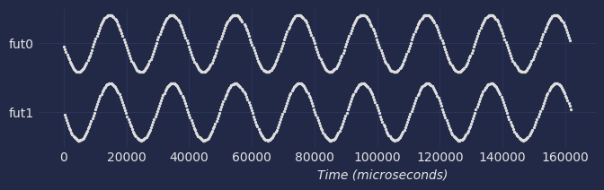
</p>

Alright! We managed to plot two sine waves in the most convoluted method ever! *And* both graphs are plotted parallel to one another. Could it be that Tokio futures are actually parallel and not just concurrent? Let's take a closer look.

First, let's add the sine value calculation times to our generated samples and update the plotting code to show this duration in the graphics.

```rust
struct Sample {
    fut_name: String,
    value: f32,
    start_t: u128,
    end_t: u128
}

async fn produce_sin(run_start: Instant, fut_name: String, tx: mpsc::UnboundedSender<Sample>) {
    for i in 1..N {
        let start_t = run_start.elapsed().as_micros();
        let value = sin(i);
        let end_t = run_start.elapsed().as_micros();

        tx.send(Sample { fut_name, value, start_t, end_t }).unwrap();
        tokio::task::yield_now().await;
    }
}
```

This is what we see now:
<p align="center">
    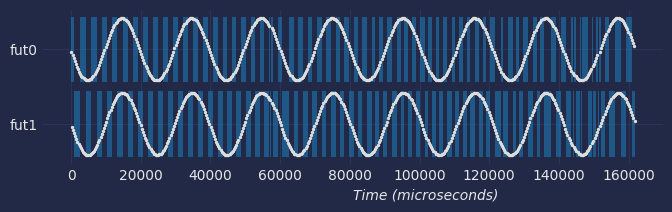
</p>

The blue blocks represent the duration it took us to calculate the sine value. In other words, this is the time our future was executed by the runtime, aka **polled**. Note that for the purpose of this visualization, our `sin()` function has a built-in 100-microsecond synchronous sleep. This is useful to make the timings more prominent and uniform.

Now, let's zoom in a bit toward the first few samples:

<p align="center">
    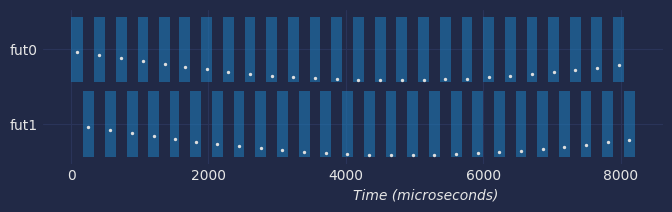
</p>

Aha! Sine value calculations alternate! When the first future calculates the sine value on its invocation, the other future is idle, or in more correct terminology, the second future *yielded* execution and let the other future continue with its work.

This is exactly the difference between **concurrency** and **parallelism**. If the async runtime ran futures in *parallel*, we would have seen all the blue blocks line up one below the other, more or less in the same time frames.

## CPU-Intensive Code
"CPU-intensive code will block the async executor" is common knowledge in async programming. From Node.js and Python's asyncio to Rust's async executors, CPU-bound code is the devil. It can slow down or even hang different concurrent async operations. How intensive is "CPU-intensive" anyway? Is calculating `sin()` intensive? SHA1? JSON parsing?

Let's see how CPU-intensive code affects our visualization. We'll define a new `sin_high_cpu()` method. This sine-generating method is more CPU-intensive than the regular `f32::sin`; in fact, it takes 500 *microseconds*.

Let's add a future that produces sine values using `sin_high_cpu()`:

```rust
#[tokio::main]
async fn main() {
    let (tx, rx) = tokio::sync::mpsc::unbounded_channel();

    let mut futs = Vec::new();

    let run_start = Instant::now();

    futs.push(produce_sin(run_start, "fut0", tx.clone()).boxed());
    futs.push(produce_sin(run_start, "fut1", tx.clone()).boxed());
    futs.push(produce_sin_high_cpu(run_start, "high cpu", tx.clone()).boxed());

    futures::future::join_all(futs).await;

    drop(tx);
    plot_samples(rx).await;
}
```

This is the resulting plot:

<p align="center">
    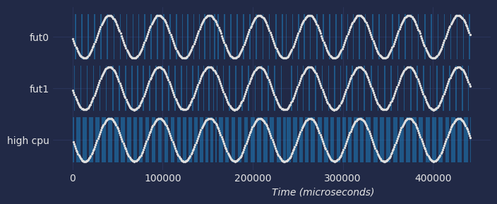
</p>

As expected, `produce_sin_high_cpu()` takes much longer to complete, almost 500ms, compared to 160ms in the previous example. But behold, the other futures, the ones that use the regular `sin()` method, take just as long.

A zoomed-in view reveals what's going on:

<p align="center">
    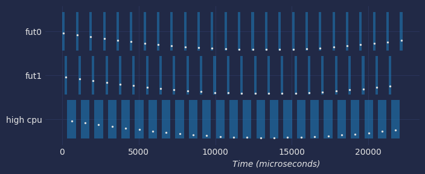
</p>

The CPU-heavy future hogs all the CPU for itself. While it works, the two other futures wait for it to yield and cannot perform their fast operations. This demonstrates the effect of CPU-intensive code. Even a "short" operation of 500µs has effects on other concurrently running futures.

Is this test realistic? Does your async code loop around and perform small CPU-bound tasks? Think about HTTP servers that handle lots of multiple requests, parse incoming and outgoing JSON strings, send and receive DB query results, etc. Another common example is message queue consumers. This is an important insight: **Using a single Tokio task limits multicore utilization.** Your machine might have multiple available cores, but it's your job to utilize them. One approach for this is spawning Tokio tasks. Lets check that next.

## Tasks

Unlike Node.js, Rust's Tokio allows us to spawn a new `Task` and run futures within it. In the [multithreaded runtime](https://docs.rs/tokio/latest/tokio/runtime/index.html#multi-thread-scheduler), Tokio will create *worker threads* that will host and run the tasks. By default, Tokio's thread pool will maintain a thread for each core your CPU has, in addition to the main thread. I work on a 4-core GitHub workspace, so I have 1+4 available threads.

Let's spawn `produce_sin_high_cpu` in a Tokio task and see how it affects the plot:

```rust
#[tokio::main]
async fn main() {
    let (tx, rx) = tokio::sync::mpsc::unbounded_channel();

    let mut futs = Vec::new();

    let run_start = Instant::now();

    futs.push(produce_sin(run_start, "fut0", tx.clone()).boxed());
    futs.push(produce_sin(run_start, "fut1", tx.clone()).boxed());
    futs.push(
        tokio::spawn(produce_sin_high_cpu(run_start, "spawned", tx.clone()).boxed())
            .map(|_| ()) // we need to replace the return value with () to match the other futures
            .boxed(),
    );

    futures::future::join_all(futs).await;

    drop(tx);
    plot_samples(rx).await;
}
```

This is the resulting plot:
<p align="center">
    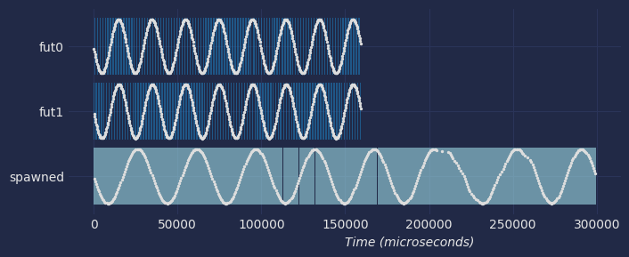
</p>

And zoomed in:

<p align="center">
    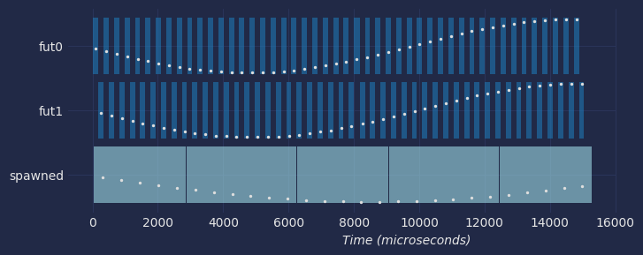
</p>

Awesome! Our first two futures produce fast sine waves again, while the CPU-bounded `sin_high_cpu` is contained and does not affect the rest of the code. Note how the first two futures finish their calculation of *N* values much faster now when they don't need to compete with `sin_high_cpu` for CPU time.

This is an important lesson: spawning a new task allowed us to easily take advantage of our CPU's multiple cores and have the "spawned" future execute in *parallel* with the other two futures.

As the more perceptive of you might have noticed, I colored the execution periods in a different color according to the thread the code was executed on. "fut0" and "fut1" are executed on the main thread (blue), and the "spawned" future is executed on some worker thread (turquoise).

## More Tasks
Ok, so if Tokio's multithreaded runtime has 1+4 available threads, what will happen if we spawn multiple tasks? Let's add some more `sin_high_cpu` tasks for our plot:

```rust
#[tokio::main]
async fn main() {
    let (tx, rx) = tokio::sync::mpsc::unbounded_channel();

    let mut futs = Vec::new();

    let run_start = Instant::now();

    futs.push(produce_sin(run_start, "fut0", tx.clone()).boxed());

    for i in 1..7 {
        let fut_name = format!("spawned{i}");
        futs.push(
            tokio::spawn(produce_sin_heavy(run_start, fut_name, tx.clone()).boxed())
                .map(|_| ())
                .boxed(),
        );
    }

    futures::future::join_all(futs).await;

    drop(tx);
    plot_samples(rx).await;
}
```

This is the resulting plot:

<p align="center">
    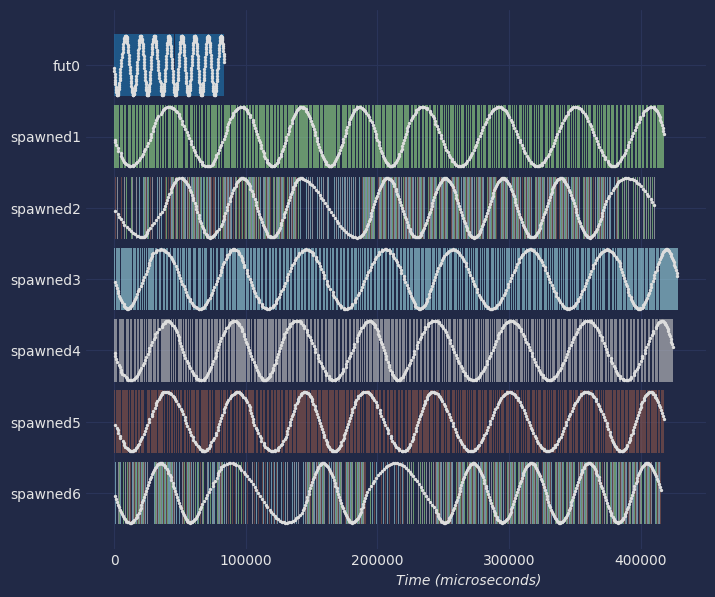
</p>

And zoomed in:

<p align="center">
    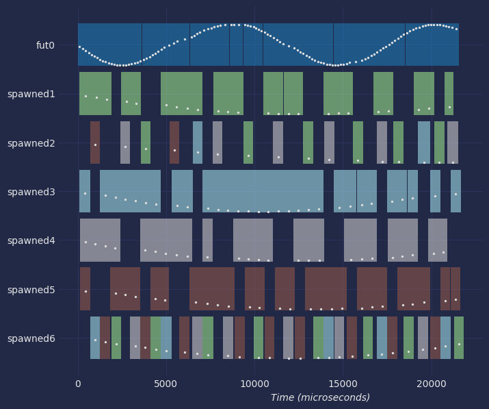
</p>

Tokio juggles the tasks between the threads. Each future polling might run in a different thread. Since we don't have enough available threads, our CPU-bound issues manifest again, and sometimes one task can stall work on other tasks. Interesting. Spawning new tasks improves parallelism, but with a hard limit. This is something we should definitely remember. In our example, look at the "spawned2" future. Note how this future and task are contending with "spawned4" and "spawned5" on the brown and gray threads.

## Spawn Blocking
Another relevant tool in Tokio's tool belt is [tokio::task::spawn_blocking()](https://docs.rs/tokio/latest/tokio/#cpu-bound-tasks-and-blocking-code). `spawn_blocking()` will spawn a block of (non-async) code in a dedicated thread pool — the **blocking** pool. This thread pool maintains a much larger thread pool.

Let's add a version of our sine producer that runs `sin_heavy()` under a `spawn_blocking` call:

```rust
async fn produce_sin_heavy_blocking(
    run_start: Instant,
    fut_name: String,
    tx: mpsc::UnboundedSender<Sample>,
) {
    for i in 1..N {
        let start = run_start.elapsed().as_micros();
        let tx = tx.clone();

        let (t_id, value) = tokio::task::spawn_blocking(move || {
            let value = sin_heavy(i);
            let t_id = thread_id::get();

            (t_id, value)
        })
        .await
        .unwrap();

        let end = run_start.elapsed().as_micros();

        let sample = Sample { fut_name, value, start, end, thread_id: t_id };

        tx.send(sample).unwrap();

        tokio::task::yield_now().await;
    }
}
```

And add a bunch of these to our visualization:

```rust
for i in 1..7 {
    futs.push(
        produce_sin_heavy_blocking(run_start, format!("spawn_blocking{i}"), tx.clone())
            .boxed(),
    );
}
```

This is the resulting plot:

<p align="center">
    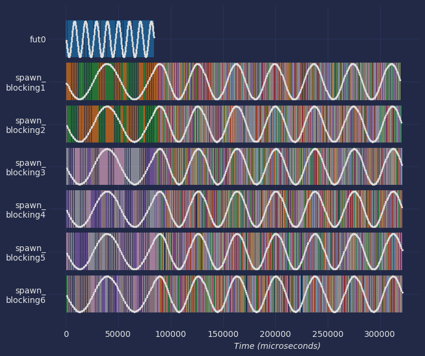
</p>

And zoomed in:

<p align="center">
    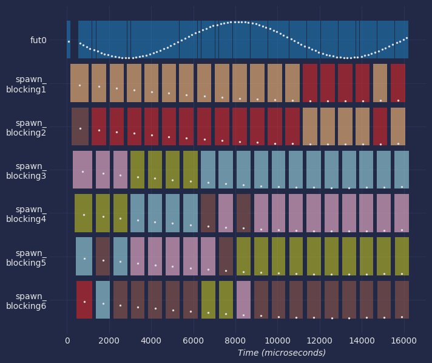
</p>

I don't know about you, but this zoomed-in plot is oddly satisfying for me. Each sine calculation is done on a free thread, and supposedly we've reached peak efficiency. Of course, we need to remember that we didn't grow CPU cores out of thin air. Some of these threads are running on the same core, context switching and sharing resources after all.

In fact `spawn_blocking` is not always the best choice for CPU-heavy tasks. Often we want to dedicate a limited number of threads to such code. [Async: What is blocking?](https://ryhl.io/blog/async-what-is-blocking/) is a nice post by Alice Ryhl that goes into details and surveys some alternatives.

# What Did We Learn

Visualizing futures runtime like this really makes some pennies drop. The difference between concurrent and parallel execution pops out, and multicore utilization becomes intuitive.

It's much easier now to reason about Tokios behavior, even without deep familiarity with its codebase. Async programming in Rust is nuanced, but I hope this post has helped you grasp it a little better.

### Appendix: Running Demo Code
The demo code uses some Python code to plot the visualizations. To run it:
- Make sure you have [rye](https://rye.astral.sh/) installed
- Install Python dependencies: `rye sync`
- Activate Python virtual environment: `source .venv/bin/activate`
- Run the code: `cargo run`